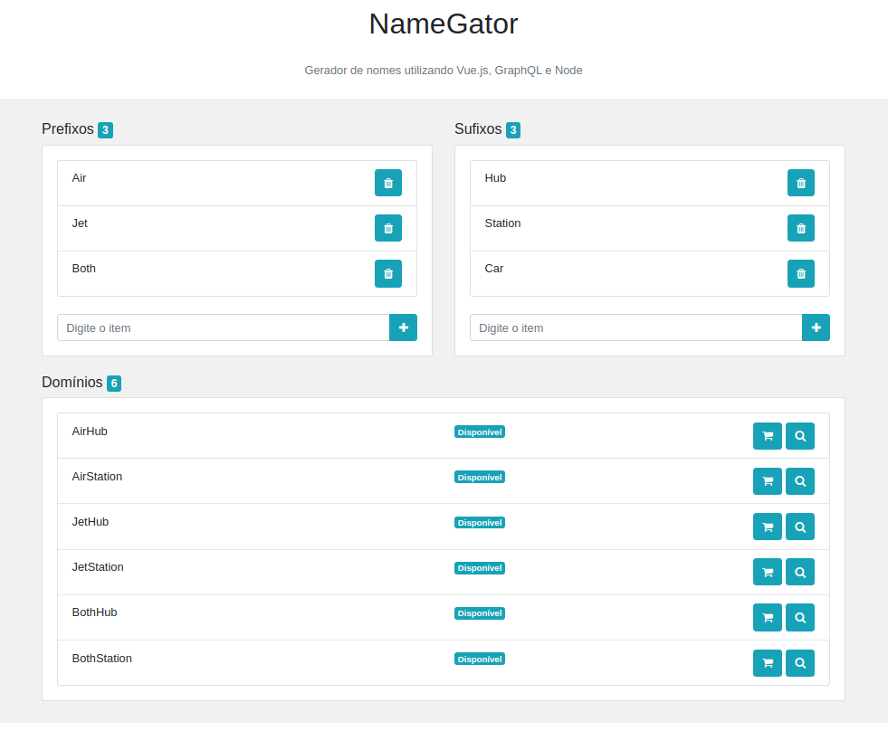

## NameGator

- Projeto simples onde é possível adicionar um prefixo e sufixo e com a identação deles criar um dominio para ser registrado.

## Stack

- Javacript
- Node
- Graphql
- Vue
- Postgresql

## Image Project



## BACK END

### Installation <a name="install"></a>

Enter in `/database` and execute `create.sql` in you database.

Enter in folder `/server` and configure `database.js`:

```postgresql
const client = new Client({
  user: "postgres",
  password: "postgres",
  host: "localhost",
  database: "namegator",
  port: 5432
});
```

After configuration, run the command line.

```js
npm install
```

after...

```js
node server
```

Great! Server runing...

## FRONT END

### Installation <a name="install2"></a>

Enter in folder `/server` and execute commands:

```js
npm install
```

after...

```js
npm run serve
```
